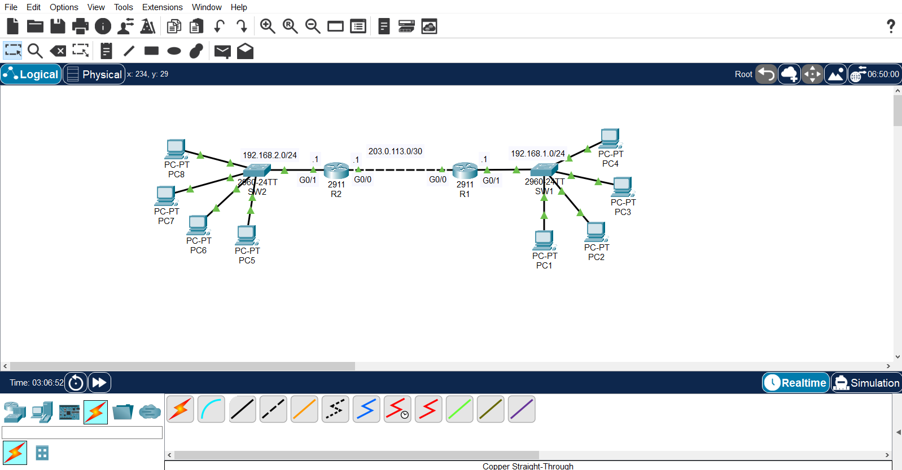
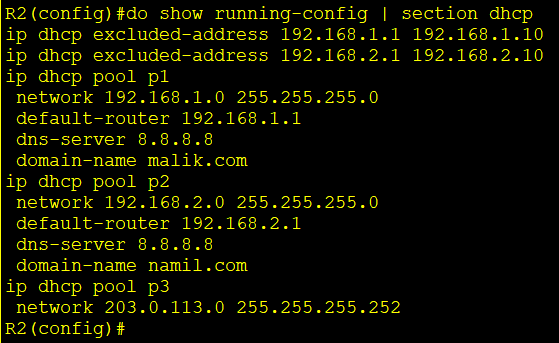
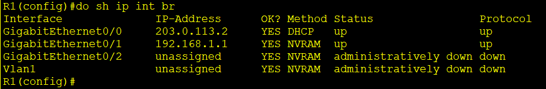

# DHCP Server, Client & Relay Agent Lab

A Cisco Packet Tracer lab configuring R2 as a DHCP server with three pools, R1's WAN interface as a DHCP client, and R1 as a **DHCP relay agent** so hosts on a subnet without a locally attached DHCP server can still be served by R2.

## Topology



| Segment | Network | Devices | Router Interface |
|---|---|---|---|
| LAN1 (192.168.2.0/24) | 192.168.2.0/24 | SW2, PC2, PC5, PC6, PC7 | R2 — G0/1 |
| LAN2 (192.168.1.0/24) | 192.168.1.0/24 | SW1, PC0, PC1, PC3, PC4 | R1 — G0/1 |
| WAN | 203.0.113.0/30 | Serial-style link | R2 G0/0 — R1 G0/0 |

R2's DHCP server sits directly on the 192.168.2.0/24 LAN, but 192.168.1.0/24 is on the other side of the WAN link — which is why R1 needs a DHCP relay agent to forward requests from that subnet to R2.

## Device Addressing

| Device | Interface | IP Address | Method |
|---|---|---|---|
| R2 | G0/1 | 192.168.2.1/24 | Static |
| R2 | G0/0 | 203.0.113.1/30 | Static |
| R1 | G0/0 | 203.0.113.2/30 | **DHCP (client)** |
| R1 | G0/1 | 192.168.1.1/24 | Static |
| PC1 | NIC | 192.168.1.11/24 (leased) | DHCP |
| PC2 | NIC | 192.168.2.11/24 (leased) | DHCP |

## DHCP Pool Configuration (R2)

```
ip dhcp excluded-address 192.168.1.1 192.168.1.10
ip dhcp excluded-address 192.168.2.1 192.168.2.10

ip dhcp pool p1
 network 192.168.1.0 255.255.255.0
 default-router 192.168.1.1
 dns-server 8.8.8.8
 domain-name malik.com

ip dhcp pool p2
 network 192.168.2.0 255.255.255.0
 default-router 192.168.2.1
 dns-server 8.8.8.8
 domain-name namil.com

ip dhcp pool p3
 network 203.0.113.0 255.255.255.252
```

| Pool | Subnet | Reserved (excluded) | Default Gateway | DNS | Domain |
|---|---|---|---|---|---|
| p1 | 192.168.1.0/24 | .1 – .10 | 192.168.1.1 (R1) | 8.8.8.8 | malik.com |
| p2 | 192.168.2.0/24 | .1 – .10 | 192.168.2.1 (R2) | 8.8.8.8 | namil.com |
| p3 | 203.0.113.0/30 | *(none configured)* | — | — | — |

> **Note:** the lab requirement was to also reserve `.1` on the 203.0.113.0/30 pool (`p3`), since that address is statically assigned to R2's G0/0. The captured configuration doesn't show an `ip dhcp excluded-address 203.0.113.1 203.0.113.1` line for it — worth adding to avoid a potential address conflict if that pool is ever actually leased from.

## R1 — DHCP Client on G0/0

```
interface GigabitEthernet0/0
 ip address dhcp
```

**Lab question — what address did R1's G0/0 configure?**
Confirmed via `show ip interface brief`: R1 obtained **203.0.113.2/30** from R2's `p3` pool — the only usable address in that /30 besides R2's own `.1`.

```
Interface              IP-Address      OK? Method  Status                Protocol
GigabitEthernet0/0     203.0.113.2     YES DHCP    up                    up
GigabitEthernet0/1     192.168.1.1     YES NVRAM   up                    up
```

## R1 — DHCP Relay Agent for 192.168.1.0/24

```
interface GigabitEthernet0/1
 ip address 192.168.1.1 255.255.255.0
 ip helper-address 203.0.113.1
```

`ip helper-address` is applied on **G0/1**, the interface facing the 192.168.1.0/24 clients, and points to **203.0.113.1** — R2's WAN interface. This converts DHCP broadcasts arriving from PC0/PC1/PC3/PC4 into a unicast request sent to R2, since R2 hosts the `p1` pool for that subnet but isn't directly attached to it.

LAN2 (192.168.2.0/24) needs no relay configuration, since R2 — the DHCP server — is directly connected to that subnet via G0/1.

## Skills Demonstrated

- Configuring multiple DHCP pools on a single router, each with its own excluded range, gateway, DNS server, and domain name
- Configuring a router interface as a DHCP client (`ip address dhcp`)
- Understanding when a DHCP relay agent is required (server not on the same broadcast domain as the client) vs. when it isn't
- Configuring `ip helper-address` on the correct interface facing the clients
- Verifying DHCP leases from the client side using `ipconfig /release` and `/renew`
- Verification with `show running-config`, `show ip interface brief`, and `show ip dhcp binding`

## Evidence

### DHCP Configuration



### R1 as DHCP Client



### DHCP Lease Requests (PC1 & PC2)

**PC1 — `ipconfig /release` then `/renew`:**
```
C:\>ipconfig /release

IP Address......................: 0.0.0.0
Subnet Mask.....................: 0.0.0.0
Default Gateway.................: 0.0.0.0
DNS Server......................: 0.0.0.0

C:\>ipconfig /renew

IP Address......................: 192.168.1.11
Subnet Mask.....................: 255.255.255.0
Default Gateway.................: 192.168.1.1
DNS Server......................: 8.8.8.8
```

**PC2 — `ipconfig /release` then `/renew`:**
```
C:\>ipconfig /release

IP Address......................: 0.0.0.0
Subnet Mask.....................: 0.0.0.0
Default Gateway.................: 0.0.0.0
DNS Server......................: 0.0.0.0

C:\>ipconfig /renew

IP Address......................: 192.168.2.11
Subnet Mask.....................: 255.255.255.0
Default Gateway.................: 192.168.2.1
DNS Server......................: 8.8.8.8
```

PC1's successful lease across the WAN link confirms the DHCP relay agent on R1 is working correctly — the request was relayed to R2 and the response returned to PC1 with the correct pool (`p1`) settings, including a domain of `malik.com`.

## Verification

The following commands were used to verify the configuration:

```bash
show running-config | section dhcp
show ip interface brief
show ip dhcp binding
ipconfig /release
ipconfig /renew
```
