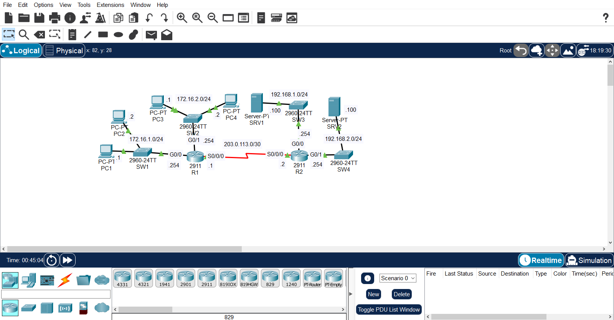
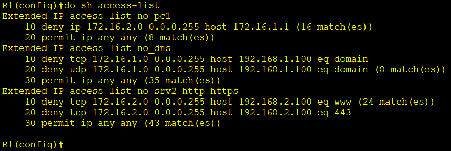
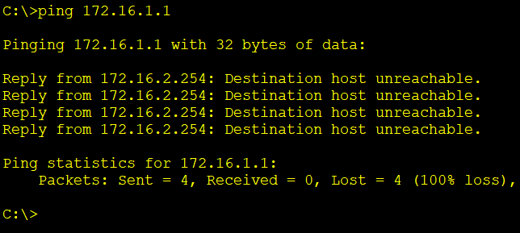
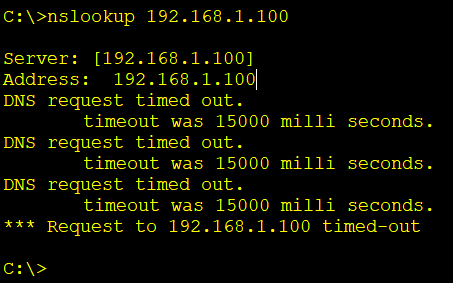
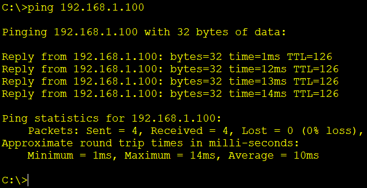
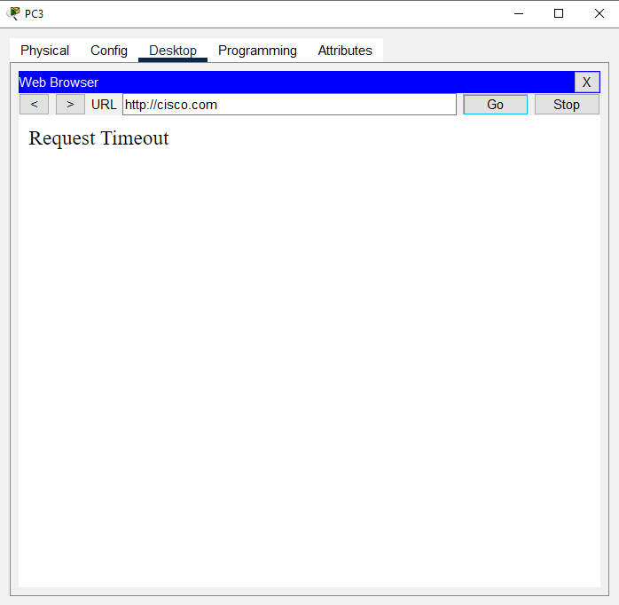
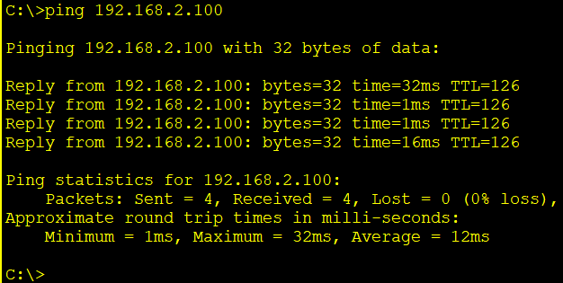

# Extended ACL Security Lab

A Cisco Packet Tracer lab applying **extended ACLs** on R1 to enforce three specific network policies — one host-level restriction and two service-level restrictions (DNS, HTTP/HTTPS) — while leaving all other traffic unaffected.

IPv4 addressing and full routing (OSPF) between all four networks were already configured and working before this lab. This document focuses on the extended ACLs added on top of that connectivity.

## Topology



| Segment | Network | Devices | Router Interface |
|---|---|---|---|
| LAN1 | 172.16.1.0/24 | SW1, PC1, PC2 | R1 — G0/0 |
| LAN2 | 172.16.2.0/24 | SW2, PC3, PC4 | R1 — G0/1 |
| LAN3 | 192.168.1.0/24 | SW3, SRV1 (DNS) | R2 — G0/0 |
| LAN4 | 192.168.2.0/24 | SW4, SRV2 (HTTP/HTTPS) | R2 — G0/1 |
| WAN | 203.0.113.0/30 | Serial link | R1 S0/0/0 — R2 S0/0/0 |

## Device Addressing

| Device | Interface | IP Address |
|---|---|---|
| PC1 | NIC | 172.16.1.1/24 |
| PC2 | NIC | 172.16.1.2/24 |
| R1 | G0/0 | 172.16.1.254/24 |
| PC3 | NIC | 172.16.2.1/24 |
| PC4 | NIC | 172.16.2.2/24 |
| R1 | G0/1 | 172.16.2.254/24 |
| R1 | S0/0/0 | 203.0.113.1/30 |
| R2 | S0/0/0 | 203.0.113.2/30 |
| SRV1 | NIC | 192.168.1.100/24 |
| R2 | G0/0 | 192.168.1.254/24 |
| SRV2 | NIC | 192.168.2.100/24 |
| R2 | G0/1 | 192.168.2.254/24 |

## Network Policies

| # | Policy |
|---|---|
| 1 | Hosts in 172.16.2.0/24 can't communicate with PC1 |
| 2 | Hosts in 172.16.1.0/24 can't access the DNS service on SRV1 |
| 3 | Hosts in 172.16.2.0/24 can't access the HTTP or HTTPS services on SRV2 |

Unlike standard ACLs, extended ACLs can match on both source **and** destination, plus protocol and port — which is what makes policies 2 and 3 possible: only a specific service to a specific host is blocked, not all traffic to that host.

## ACL Configuration (R1)

```
ip access-list extended no_pc1
 10 deny ip 172.16.2.0 0.0.0.255 host 172.16.1.1
 20 permit ip any any

ip access-list extended no_dns
 10 deny tcp 172.16.1.0 0.0.0.255 host 192.168.1.100 eq domain
 20 deny udp 172.16.1.0 0.0.0.255 host 192.168.1.100 eq domain
 30 permit ip any any

ip access-list extended no_srv2_http_https
 10 deny tcp 172.16.2.0 0.0.0.255 host 192.168.2.100 eq www
 20 deny tcp 172.16.2.0 0.0.0.255 host 192.168.2.100 eq 443
 30 permit ip any any

interface GigabitEthernet0/0
 ip access-group no_dns in
 ip access-group no_pc1 out

interface GigabitEthernet0/1
 ip access-group no_srv2_http_https in
```

DNS uses both TCP and UDP port 53 (`eq domain`), so `no_dns` denies both protocols to be thorough. HTTP and HTTPS are matched separately as `eq www` (port 80) and `eq 443`, since each is its own TCP port.

### ACL Application Logic

| ACL | Interface | Direction | Enforces |
|---|---|---|---|
| `no_dns` | G0/0 (172.16.1.0/24) | in | Policy 2 — blocks DNS from LAN1 as it enters the router, before it can reach SRV1 |
| `no_pc1` | G0/0 (172.16.1.0/24) | out | Policy 1 — blocks traffic sourced from 172.16.2.0/24 as it exits toward PC1's LAN |
| `no_srv2_http_https` | G0/1 (172.16.2.0/24) | in | Policy 3 — blocks HTTP/HTTPS from LAN2 as it enters the router, before it can reach SRV2 |

Two ACLs are applied to the same interface (G0/0) but in opposite directions — `in` filters traffic arriving from LAN1, `out` filters traffic leaving toward LAN1 — which is valid since only one ACL per interface per direction is allowed.

## Skills Demonstrated

- Extended ACL syntax: matching by source, destination, protocol, and port in a single rule
- Distinguishing TCP vs. UDP for services like DNS
- Applying multiple ACLs on the same interface using different directions (`in` / `out`)
- Choosing the correct interface and direction based on where the traffic originates vs. where it's headed
- Verification with `show access-lists` and `show running-config`
- Service-level connectivity testing (blocking a specific service without blocking the host entirely)

## Evidence

### ACL Configuration



### Policy Testing

| Test | Expected Result | Evidence |
|---|---|---|
| PC3 → PC1 (`ping 172.16.1.1`) | Fail (Policy 1) |  |
| PC1 → SRV1 DNS lookup | Fail (Policy 2) |  |
| PC1 → SRV1 (`ping 192.168.1.100`) | Success — only DNS is blocked, not the host |  |
| PC3 → SRV2 (HTTP/HTTPS in browser) | Fail (Policy 3) |  |
| PC3 → SRV2 (`ping 192.168.2.100`) | Success — only HTTP/HTTPS is blocked, not the host |  |

**PC1 → SRV1, `nslookup 192.168.1.100`:**
```
Server:  [192.168.1.100]
Address:  192.168.1.100

DNS request timed out.
    timeout was 15000 milli seconds.
DNS request timed out.
    timeout was 15000 milli seconds.
DNS request timed out.
    timeout was 15000 milli seconds.
*** Request to 192.168.1.100 timed-out
```

## Verification

The following commands were used to verify the configuration:

```bash
show access-lists
show running-config | section interface
ping 172.16.1.1
ping 192.168.1.100
ping 192.168.2.100
```
