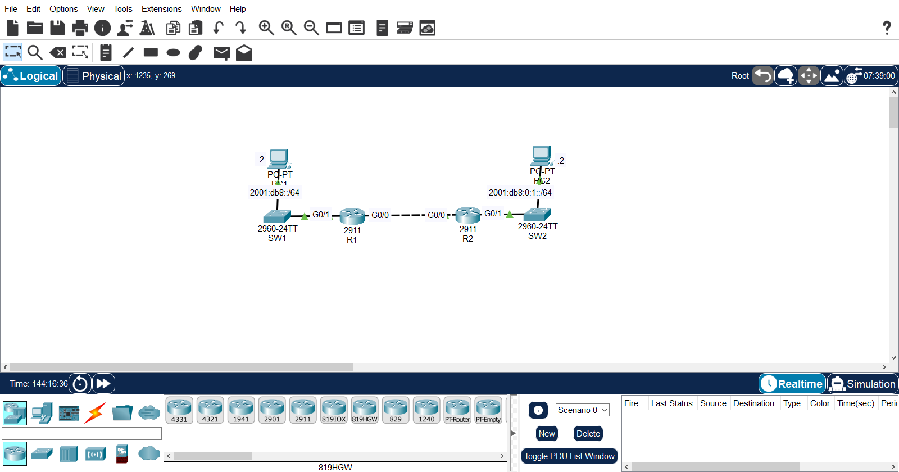
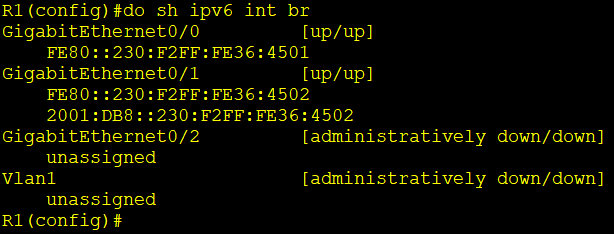
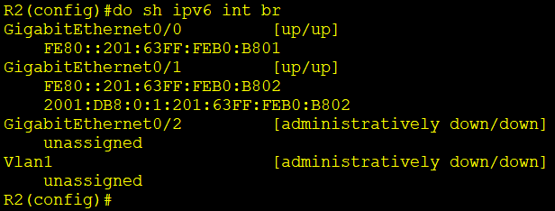
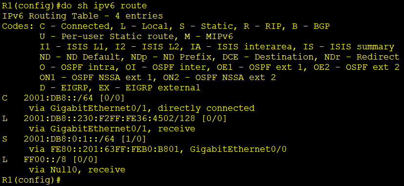
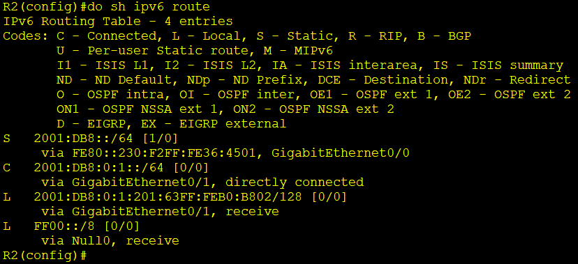
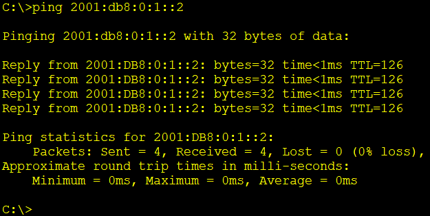

# IPv6 Addressing (EUI-64) & Static Routing Lab

A Cisco Packet Tracer lab configuring IPv6 addressing across two routers using the **EUI-64** method to auto-generate interface IDs, with IPv6 static routes configured to provide end-to-end connectivity between two LANs.

## Overview

IPv4 addressing and interface configuration were already in place on this topology. This lab layers IPv6 on top of it:

- LAN-facing router interfaces (G0/1) get their IPv6 address via **EUI-64**, generated from the interface's MAC address — calculated manually before configuration.
- The R1–R2 link (G0/0) runs IPv6 with **no global address configured**, using only its automatically generated link-local address.
- Static IPv6 routes connect the two LANs across that link-local-only link.

## Topology



| Segment | Devices | Router Interface |
|---|---|---|
| LAN1 | SW1, PC1 | R1 — G0/1 |
| LAN2 | SW2, PC2 | R2 — G0/1 |
| R1–R2 Link | Point-to-point | R1 G0/0 — R2 G0/0 |

## IPv6 Addressing Plan

| Segment | Prefix | Assigned To | Method |
|---|---|---|---|
| LAN1 | 2001:db8::/64 | R1 G0/1 | EUI-64 |
| LAN1 | 2001:db8::/64 | PC1 → 2001:db8::2/64 | Manual, gateway = 2001:DB8::230:F2FF:FE36:4502 |
| LAN2 | 2001:db8:0:1::/64 | R2 G0/1 | EUI-64 |
| LAN2 | 2001:db8:0:1::/64 | PC2 → 2001:db8:0:1::2/64 | Manual, gateway = 2001:DB8:0:1:201:63FF:FEB0:B802 |
| R1–R2 Link | Link-local only | R1 G0/0, R2 G0/0 | `ipv6 enable` — no global address |

## EUI-64 Interface ID Calculation

R1 — G0/1 (MAC 0030.F236.4502)

Split the MAC address in half: 0030.F2 | 36.4502
Insert FFFE in the middle: 0030:F2FF:FE36:4502
Flip the 7th bit of the first byte: 00 → 02
Append the result after the /64 prefix: 2001:DB8::230:F2FF:FE36:4502/64

R2 — G0/1 (MAC 0001.63B0.B802)

Split the MAC address in half: 0001.63 | B0.B802
Insert FFFE in the middle: 0001:63FF:FEB0:B802
Flip the 7th bit of the first byte: 00 → 02
Append the result after the /64 prefix: 2001:DB8:0:1:201:63FF:FEB0:B802/64

Verified against `show ipv6 interface brief` on each router:

| Router | Interface | EUI-64 Interface ID | Full IPv6 Address |
|---|---|---|---|
| R1 | G0/1 | 230:F2FF:FE36:4502 | 2001:DB8::230:F2FF:FE36:4502/64 |
| R2 | G0/1 | 201:63FF:FEB0:B802 | 2001:DB8:0:1:201:63FF:FEB0:B802/64 |

Link-local addresses generated on the R1–R2 point-to-point link (G0/0, no global address configured):

| Router | Interface | Link-local Address |
|---|---|---|
| R1 | G0/0 | FE80::230:F2FF:FE36:4501 |
| R2 | G0/0 | FE80::201:63FF:FEB0:B801 |

## Router Configuration

**R1**
```
interface g0/1
 ipv6 address 2001:db8::/64 eui-64
 no shutdown

interface g0/0
 ipv6 enable
 no shutdown
```

**R2**
```
interface g0/1
 ipv6 address 2001:db8:0:1::/64 eui-64
 no shutdown

interface g0/0
 ipv6 enable
 no shutdown
```

**PC1** — IPv6 address `2001:db8::2/64`, default gateway `2001:DB8::230:F2FF:FE36:4502` (R1 G0/1)
**PC2** — IPv6 address `2001:db8:0:1::2/64`, default gateway `2001:DB8:0:1:201:63FF:FEB0:B802` (R2 G0/1)

## Static IPv6 Routes

G0/0 on R1 and R2 has no global address — only a link-local address. Because of this, each `ipv6 route` command must specify **both the exit interface and the neighbor's link-local next-hop** (a link-local address alone isn't enough for the router to determine the outgoing interface).

**R1**
```
ipv6 route 2001:db8:0:1::/64 g0/0 FE80::201:63FF:FEB0:B801
```

**R2**
```
ipv6 route 2001:db8::/64 g0/0 FE80::230:F2FF:FE36:4501
```

## Skills Demonstrated

- IPv6 addressing fundamentals and address types (global unicast vs. link-local)
- Manually calculating an EUI-64 interface ID from a MAC address
- Configuring IPv6 on Cisco routers using the `eui-64` keyword
- Enabling IPv6 on an interface without a global address (`ipv6 enable`)
- IPv6 static routing using exit-interface + link-local next-hop syntax
- Verification with `show ipv6 interface brief` and `show ipv6 route`
- End-to-end IPv6 connectivity testing

## Evidence

### IPv6 Interface Configuration

| Router | Evidence |
|---|---|
| R1 |  |
| R2 |  |

### IPv6 Routing Tables

| Router | Evidence |
|---|---|
| R1 |  |
| R2 |  |

### Connectivity Test



## Verification

The following commands were used to verify the configuration:

```bash
show ipv6 interface brief
show ipv6 route
ping 2001:db8:0:1::2
```

**Result — PC1 → PC2:**
```
Pinging 2001:db8:0:1::2 with 32 bytes of data:

Reply from 2001:DB8:0:1::2: bytes=32 time<1ms TTL=126
Reply from 2001:DB8:0:1::2: bytes=32 time<1ms TTL=126
Reply from 2001:DB8:0:1::2: bytes=32 time<1ms TTL=126
Reply from 2001:DB8:0:1::2: bytes=32 time<1ms TTL=126

Ping statistics for 2001:db8:0:1::2:
Packets: Sent = 4, Received = 4, Lost = 0 (0% loss),
Approximate round trip times in milli-seconds:
Minimum = 0ms, Maximum = 0ms, Average = 0ms
```
