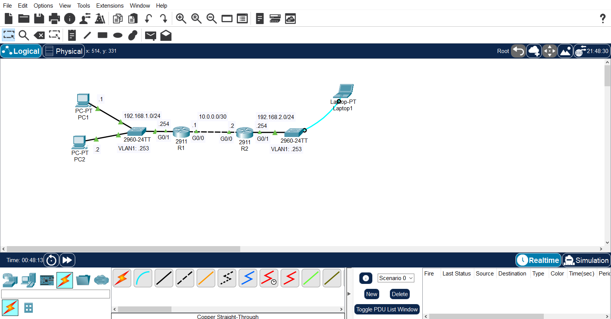
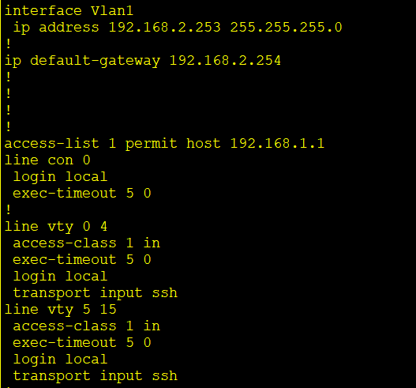
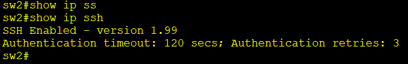
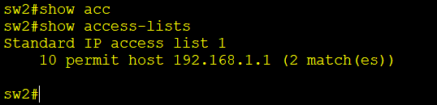
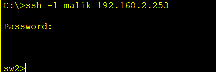
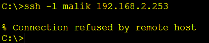

# Switch Security: Console & SSH Remote Access Lab

A Cisco Packet Tracer lab configuring a newly added switch (SW2) from scratch via its console port, then locking down remote management to **SSH-only**, restricted to a single trusted host.

## Topology



| Segment | Network | Devices | Router Interface |
|---|---|---|---|
| LAN1 | 192.168.1.0/24 | SW1, PC1, PC2 | R1 — G0/1 |
| WAN | 10.0.0.0/30 | Point-to-point link | R1 G0/0 — R2 G0/0 |
| LAN2 | 192.168.2.0/24 | SW2, Laptop1 | R2 — G0/1 |

SW2 was newly added and unconfigured. Initial access was performed physically via Laptop1 connected to SW2's console port, since it had no management IP or remote-access configuration yet.

## Device Addressing

| Device | Interface | IP Address |
|---|---|---|
| PC1 | NIC | 192.168.1.1/24 |
| PC2 | NIC | 192.168.1.2/24 |
| R1 | G0/1 | 192.168.1.254/24 |
| R1 | G0/0 | 10.0.0.1/30 |
| R2 | G0/0 | 10.0.0.2/30 |
| R2 | G0/1 | 192.168.2.254/24 |
| SW2 | VLAN1 SVI | 192.168.2.253/24 |

## Base Configuration (via Console)

```
hostname sw2

enable secret ccna

username malik secret ccna
ip domain-name malik.com

interface Vlan1
 ip address 192.168.2.253 255.255.255.0

ip default-gateway 192.168.2.254
```

> Secrets are stored and transmitted in hashed form (`enable secret` / `username ... secret` use MD5 type-5 hashing) — the actual hash values are left out of this document, as a public repo shouldn't expose anything that could be fed to an offline cracking attempt, even for lab credentials.

The default gateway points to R2 (192.168.2.254), since SW2's VLAN1 SVI is a host on that subnet and needs a path off its local network for any management traffic destined elsewhere.

## Console Line Security

```
line con 0
 login local
 exec-timeout 5 0
```

| Setting | Value |
|---|---|
| Authentication | Local (username/password database) |
| Exec timeout | 5 minutes |

## SSH Remote Access

```
ip domain-name malik.com
crypto key generate rsa general-keys modulus 2048

access-list 1 permit host 192.168.1.1

line vty 0 4
 access-class 1 in
 login local
 exec-timeout 5 0
 transport input ssh

line vty 5 15
 access-class 1 in
 login local
 exec-timeout 5 0
 transport input ssh
```

| Setting | Value |
|---|---|
| Domain name | malik.com |
| RSA key size | 2048 bits |
| Authentication | Local (username/password database) |
| Exec timeout | 5 minutes |
| Allowed protocol | SSH only (`transport input ssh` — Telnet disabled) |
| Access restriction | Standard ACL 1 — permits only `192.168.1.1` (PC1) |

The RSA key generation (`crypto key generate rsa`) is what actually enables the SSH server on the switch — it can't run without a key pair. `transport input ssh` on both VTY ranges (0–4 and 5–15) ensures Telnet is rejected on every line, and `access-class 1 in` applies the host restriction to every incoming VTY session, so even a correct username/password from any other host is refused before authentication is attempted.

## Skills Demonstrated

- Initial out-of-band switch configuration via console port
- Configuring a management SVI (VLAN1) and default gateway on a switch
- Local user authentication vs. enable secret
- Console line hardening (`exec-timeout`, `login local`)
- Enabling and hardening SSH access: domain name, RSA key generation, local authentication, exec timeout
- Disabling Telnet in favor of SSH-only remote access
- Restricting VTY access to a specific host using a standard ACL with `access-class`

## Evidence

### Base & Console Configuration



### SSH Configuration

| Evidence | Screenshot |
|---|---|
| `show ip ssh` |  |
| `show access-lists` |  |

### Remote Access Test

| Test | Expected Result | Evidence |
|---|---|---|
| PC1 → SSH to 192.168.2.253 | Success |  |
| PC2 → SSH to 192.168.2.253 | Fail — not PC1, blocked by ACL 1 |  |

## Verification

The following commands were used to verify the configuration:

```bash
show running-config
show ip ssh
show access-lists
```
