# OSPF Routing & Standard ACL Security Lab

A Cisco Packet Tracer lab connecting four networks across two routers using **OSPF** for full IP connectivity, then applying **standard ACLs** (numbered on R1, named on R2) to enforce a set of inter-network access policies.

## Topology

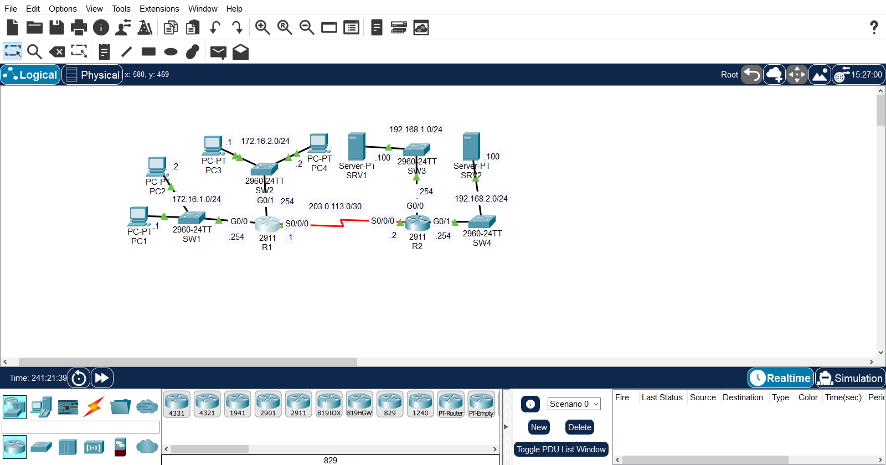

| Segment | Network | Devices | Router Interface |
|---|---|---|---|
| LAN1 | 172.16.1.0/24 | SW1, PC1, PC2 | R1 — G0/0 |
| LAN2 | 172.16.2.0/24 | SW2, PC3, PC4 | R1 — G0/1 |
| LAN3 | 192.168.1.0/24 | SW3, SRV1 | R2 — G0/0 |
| LAN4 | 192.168.2.0/24 | SW4, SRV2 | R2 — G0/1 |
| WAN | 203.0.113.0/30 | Serial link | R1 S0/0/0 — R2 S0/0/0 |

## Device Addressing

| Device | Interface | IP Address |
|---|---|---|
| PC1 | NIC | 172.16.1.1/24 |
| PC2 | NIC | 172.16.1.2/24 |
| R1 | G0/0 | 172.16.1.254/24 |
| PC3 | NIC | 172.16.2.1/24 |
| PC4 | NIC | 172.16.2.2/24 |
| R1 | G0/1 | 172.16.2.254/24 |
| R1 | S0/0/0 | 203.0.113.1/30 |
| R2 | S0/0/0 | 203.0.113.2/30 |
| SRV1 | NIC | 192.168.1.100/24 |
| R2 | G0/0 | 192.168.1.254/24 |
| SRV2 | NIC | 192.168.2.100/24 |
| R2 | G0/1 | 192.168.2.254/24 |

## OSPF Configuration

Single-area OSPF (area 0), process ID 1. LAN-facing interfaces are advertised but set as **passive** so OSPF hellos are only sent over the serial link between R1 and R2. Router IDs were not manually configured — Cisco auto-selected them from the highest active interface IP.

**R1**
```
router ospf 1
 log-adjacency-changes
 passive-interface GigabitEthernet0/0
 passive-interface GigabitEthernet0/1
 network 172.16.1.0 0.0.0.255 area 0
 network 172.16.2.0 0.0.0.255 area 0
 network 203.0.113.0 0.0.0.3 area 0
```

**R2**
```
router ospf 1
 log-adjacency-changes
 passive-interface GigabitEthernet0/0
 passive-interface GigabitEthernet0/1
 network 192.168.1.0 0.0.0.255 area 0
 network 192.168.2.0 0.0.0.255 area 0
 network 203.0.113.0 0.0.0.3 area 0
```

### OSPF Verification

**Neighbor adjacency (R1 & R2) — FULL state over the serial link:**
```
Neighbor ID     Pri   State           Dead Time   Address         Interface
203.0.113.2     0     FULL/  -        00:00:34    203.0.113.2     Serial0/0/0
```

**R1 — routes learned via OSPF:**
```
O    192.168.1.0 [110/65] via 203.0.113.2, Serial0/0/0
O    192.168.2.0 [110/65] via 203.0.113.2, Serial0/0/0
```

**R2 — routes learned via OSPF:**
```
O    172.16.1.0 [110/65] via 203.0.113.1, Serial0/0/0
O    172.16.2.0 [110/65] via 203.0.113.1, Serial0/0/0
```

## Network Policies

| # | Policy |
|---|---|
| 1 | Only PC1 and PC3 can access 192.168.1.0/24 |
| 2 | Hosts in 172.16.2.0/24 can't access 192.168.2.0/24 |
| 3 | 172.16.1.0/24 can't access 172.16.2.0/24 |
| 4 | 172.16.2.0/24 can't access 172.16.1.0/24 |

## ACL Configuration

### R1 — Standard Numbered ACLs

Policies 3 and 4 (blocking traffic between the two local LANs) are enforced on R1, applied **outbound** on the interface leading to the LAN being protected.

```
access-list 1 deny 172.16.1.0 0.0.0.255
access-list 1 permit any

access-list 2 deny 172.16.2.0 0.0.0.255
access-list 2 permit any

interface GigabitEthernet0/0
 ip access-group 2 out

interface GigabitEthernet0/1
 ip access-group 1 out
```

| ACL | Applied On | Direction | Enforces |
|---|---|---|---|
| 1 | G0/1 (172.16.2.0/24) | out | Policy 3 — 172.16.1.0/24 can't reach 172.16.2.0/24 |
| 2 | G0/0 (172.16.1.0/24) | out | Policy 4 — 172.16.2.0/24 can't reach 172.16.1.0/24 |

### R2 — Standard Named ACLs

Policies 1 and 2 (controlling access to the server LANs) are enforced on R2, applied **outbound** on the interface leading to each server subnet.

```
ip access-list standard To_192.168.1.0
 permit host 172.16.2.1
 permit host 172.16.1.1
 deny any

ip access-list standard To_192.168.2.0/24
 deny 172.16.2.0 0.0.0.255
 permit any

interface GigabitEthernet0/0
 ip access-group To_192.168.1.0 out

interface GigabitEthernet0/1
 ip access-group To_192.168.2.0/24 out
```

| ACL | Applied On | Direction | Enforces |
|---|---|---|---|
| To_192.168.1.0 | G0/0 (192.168.1.0/24) | out | Policy 1 — only PC1 (172.16.1.1) and PC3 (172.16.2.1) can reach SRV1's subnet |
| To_192.168.2.0/24 | G0/1 (192.168.2.0/24) | out | Policy 2 — 172.16.2.0/24 can't reach SRV2's subnet |

## Skills Demonstrated

- Multi-router OSPF configuration in a single area
- Using passive interfaces to prevent unnecessary hellos on LAN segments
- Verifying OSPF neighbor adjacency and the routing table
- Translating written network policies into standard ACL logic
- Standard numbered ACLs vs. standard named ACLs
- Choosing the correct interface and direction to apply an ACL based on the policy's source/destination
- Verification with `show ip ospf neighbor`, `show ip route ospf`, and `show access-lists`
- End-to-end policy testing with `ping`

## Evidence

### OSPF

| Evidence | Screenshot |
|---|---|
| R1 — `show ip ospf neighbor` | 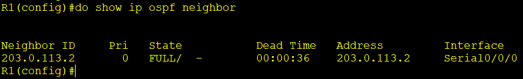 |
| R1 — `show ip route ospf` | 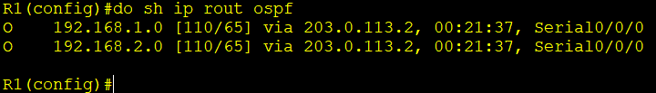 |
| R2 — `show ip route ospf` | 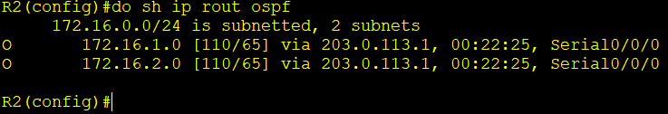 |

### ACLs

| Evidence | Screenshot |
|---|---|
| R1 — `show access-lists` | 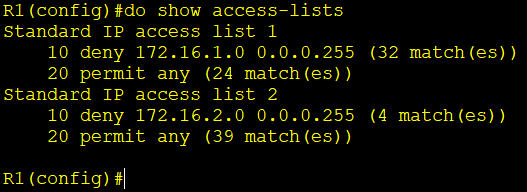 |
| R2 — `show access-lists` | 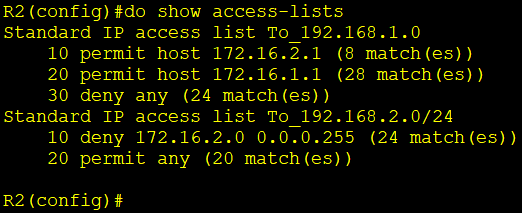 |

### Policy Testing

All four policies were verified with `ping` tests matching allowed/blocked traffic — confirmed successful.

| Test | Expected Result | Evidence |
|---|---|---|
| PC1 → SRV1 (192.168.1.100) | Success (Policy 1) | 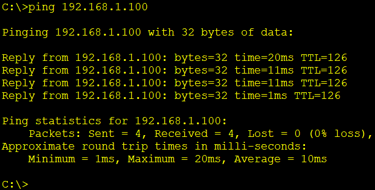 |
| PC3 → SRV1 (192.168.1.100) | Success (Policy 1) | 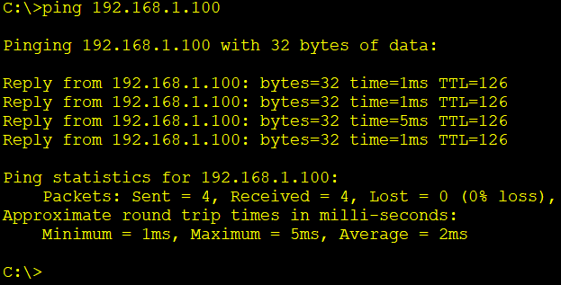 |
| PC2 → SRV1 (192.168.1.100) | Fail (Policy 1) | 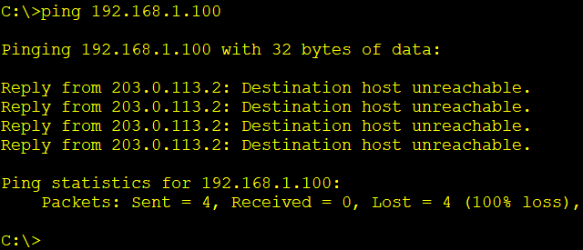 |
| PC3 → SRV2 (192.168.2.100) | Fail (Policy 2) |  |
| PC1 → PC3 (172.16.2.0/24) | Fail (Policy 3) | 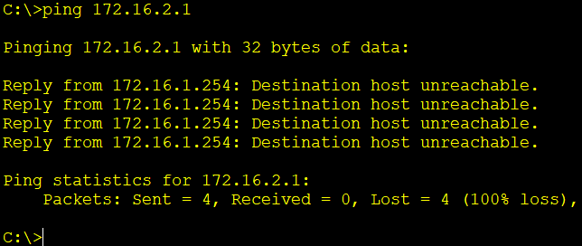 |
| PC3 → PC1 (172.16.1.0/24) | Fail (Policy 4) | 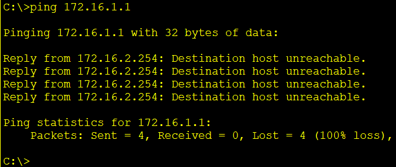 |

## Verification

The following commands were used to verify the configuration:

```bash
show ip ospf neighbor
show ip route ospf
show access-lists
show running-config | section interface
ping 192.168.1.100
ping 172.16.2.1
```
