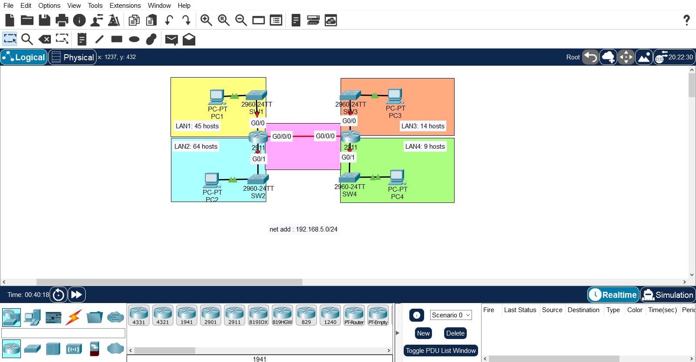
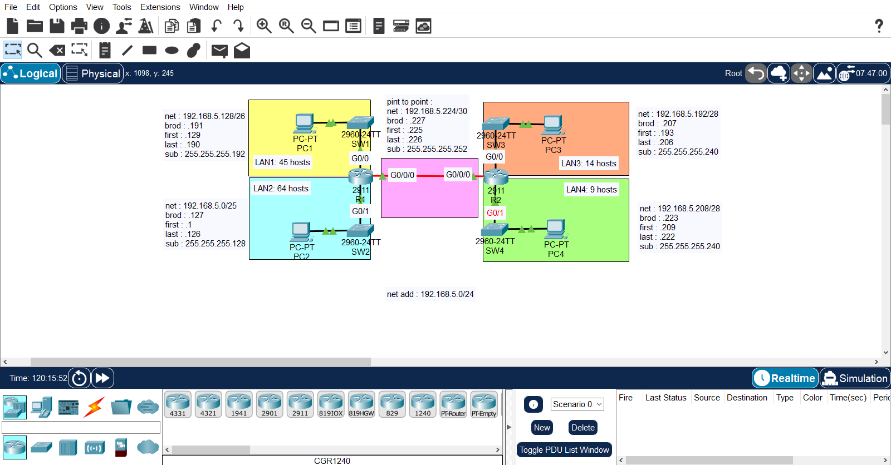
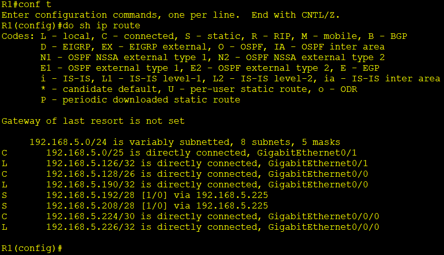
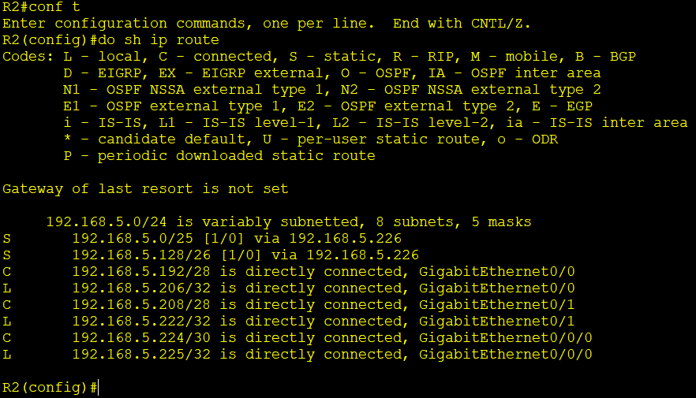
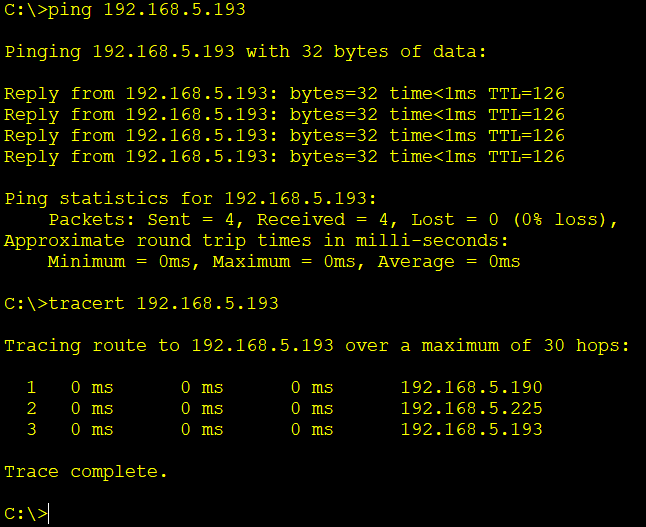
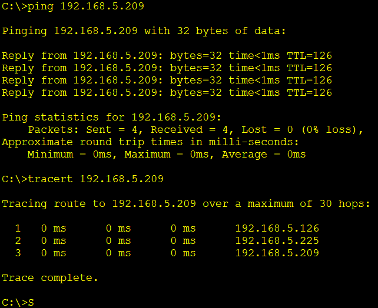

# VLSM & Static Routing Lab

A Cisco Packet Tracer lab demonstrating Variable Length Subnet Masking (VLSM) applied to a single /24 network, with static routing configured between two routers to provide full end-to-end connectivity across four LANs.

## Overview

Starting from a single address block, **192.168.5.0/24**, the network was subnetted using VLSM to create four right-sized LANs plus a dedicated point-to-point link between the two routers. Static routes were then configured on each router so that every LAN can reach every other LAN.

## Topology



Two routers (R1, R2) are connected via a point-to-point link. Each router connects to two access-layer switches, each serving one LAN.

| Segment | Requirement | Devices |
|---|---|---|
| LAN1 | 45 hosts | SW1, PC1 — off R1 G0/0 |
| LAN2 | 64 hosts | SW2, PC2 — off R1 G0/1 |
| LAN3 | 14 hosts | SW3, PC3 — off R2 G0/0 |
| LAN4 | 9 hosts | SW4, PC4 — off R2 G0/1 |
| P2P Link | 2 hosts | R1 G0/0/0 — R2 G0/0/0 |

## VLSM Subnetting Plan

Base network: **192.168.5.0/24**

| LAN | Hosts Needed | Network | Subnet Mask | Usable Range | Broadcast |
|---|---|---|---|---|---|
| LAN2 | 64 | 192.168.5.0/25 | 255.255.255.128 | .1 – .126 | .127 |
| LAN1 | 45 | 192.168.5.128/26 | 255.255.255.192 | .129 – .190 | .191 |
| LAN3 | 14 | 192.168.5.192/28 | 255.255.255.240 | .193 – .206 | .207 |
| LAN4 | 9 | 192.168.5.208/28 | 255.255.255.240 | .209 – .222 | .223 |
| P2P (R1–R2) | 2 | 192.168.5.224/30 | 255.255.255.252 | .225 – .226 | .227 |

Subnets are allocated largest-to-smallest, which is the standard VLSM approach for avoiding wasted address space.

## Device Addressing

Addressing convention: each LAN's **default gateway uses the last usable address** in the subnet, and each **PC uses the first usable address**.

| Device | Interface | IP Address | Subnet |
|---|---|---|---|
| PC1 | NIC | 192.168.5.129/26 | LAN1 |
| R1 | G0/0 | 192.168.5.190/26 | LAN1 |
| PC2 | NIC | 192.168.5.1/25 | LAN2 |
| R1 | G0/1 | 192.168.5.126/25 | LAN2 |
| R1 | G0/0/0 | 192.168.5.226/30 | P2P |
| R2 | G0/0/0 | 192.168.5.225/30 | P2P |
| PC3 | NIC | 192.168.5.193/28 | LAN3 |
| R2 | G0/0 | 192.168.5.206/28 | LAN3 |
| PC4 | NIC | 192.168.5.209/28 | LAN4 |
| R2 | G0/1 | 192.168.5.222/28 | LAN4 |

## Static Routes

Each router has one directly connected P2P neighbor and needs static routes to reach the two LANs it isn't directly attached to.

**R1**
```
ip route 192.168.5.192 255.255.255.240 192.168.5.226
ip route 192.168.5.208 255.255.255.240 192.168.5.226
```

**R2**
```
ip route 192.168.5.128 255.255.255.192 192.168.5.225
ip route 192.168.5.0   255.255.255.128 192.168.5.225
```

## Skills Demonstrated

- VLSM subnetting from a single address block based on host requirements
- Efficient allocation order (largest subnet first) to minimize wasted addresses
- Cisco router interface configuration (multiple LANs + point-to-point link)
- Static route configuration across two routers
- Routing table verification
- End-to-end connectivity testing across four LANs
- Troubleshooting using `ping` and `show ip route`

## Evidence

### VLSM Subnetting



### Routing Tables

| Router | Evidence |
|---|---|
| R1 |  |
| R2 |  |

### Connectivity Tests

| Test | Evidence |
|---|---|
| PC1 → PC3 (LAN1 → LAN3) |  |
| PC2 → PC4 (LAN2 → LAN4) |  |

## Verification

The following commands were used to verify the configuration:

```bash
show ip interface brief
show ip route
ping 192.168.5.206
ping 192.168.5.222
```
