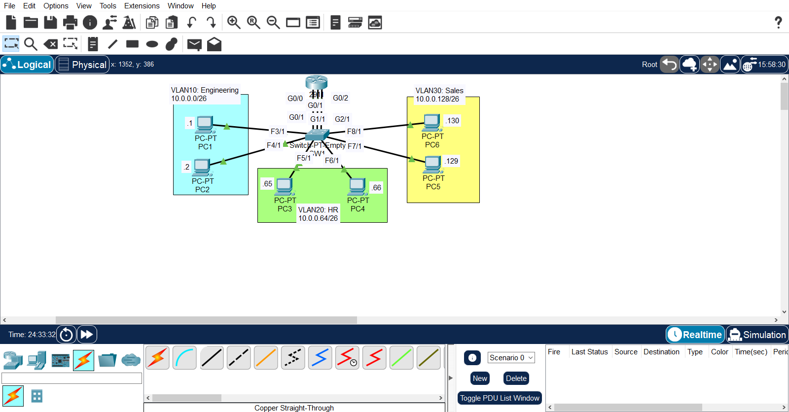
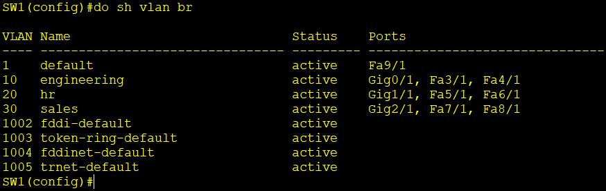
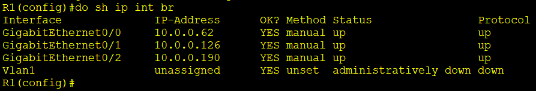
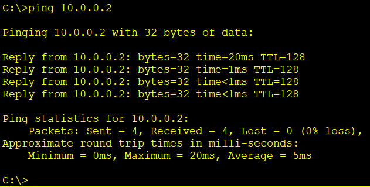
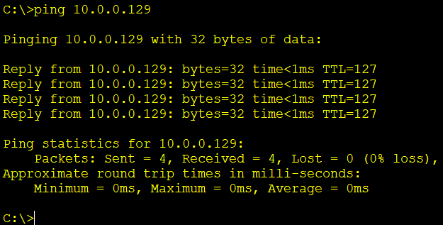
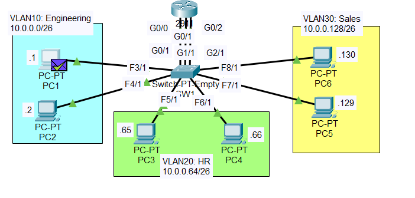

# Inter-VLAN Routing (Legacy / Router-per-VLAN) Lab

A Cisco Packet Tracer lab implementing three VLANs on a single switch, with a router providing inter-VLAN routing over **three separate physical links** — one dedicated router interface per VLAN (the "legacy" inter-VLAN routing method). The lab also demonstrates how VLANs isolate broadcast domains, verified with a broadcast ping in Simulation Mode.

## Topology



One router (R1) connects to one switch (SW1) via three links. Each link carries a single VLAN, so every switch port — including the three uplinks to R1 — is configured as an **access port**. No trunking is used.

| VLAN | Name | Subnet | Hosts | Switch Access Ports | Uplink to R1 |
|---|---|---|---|---|---|
| 10 | Engineering | 10.0.0.0/26 | PC1, PC2 | F3/1, F4/1 | SW1 G0/1 — R1 G0/0 |
| 20 | HR | 10.0.0.64/26 | PC3, PC4 | F5/1, F6/1 | SW1 G1/1 — R1 G0/1 |
| 30 | Sales | 10.0.0.128/26 | PC5, PC6 | F7/1, F8/1 | SW1 G2/1 — R1 G0/2 |

## Subnetting Plan

Base network: **10.0.0.0/24**, divided into /26 subnets (62 usable hosts each).

| VLAN | Network | Subnet Mask | Usable Range | Broadcast |
|---|---|---|---|---|
| 10 — Engineering | 10.0.0.0/26 | 255.255.255.192 | .1 – .62 | 10.0.0.63 |
| 20 — HR | 10.0.0.64/26 | 255.255.255.192 | .65 – .126 | 10.0.0.127 |
| 30 — Sales | 10.0.0.128/26 | 255.255.255.192 | .129 – .190 | 10.0.0.191 |

## Device Addressing

Addressing convention: each VLAN's **default gateway uses the last usable address** of its subnet; PCs use the lowest available addresses.

| Device | VLAN | IP Address | Subnet Mask | Default Gateway |
|---|---|---|---|---|
| PC1 | 10 | 10.0.0.1 | 255.255.255.192 | 10.0.0.62 |
| PC2 | 10 | 10.0.0.2 | 255.255.255.192 | 10.0.0.62 |
| R1 G0/0 | 10 | 10.0.0.62 | 255.255.255.192 | — |
| PC3 | 20 | 10.0.0.65 | 255.255.255.192 | 10.0.0.126 |
| PC4 | 20 | 10.0.0.66 | 255.255.255.192 | 10.0.0.126 |
| R1 G0/1 | 20 | 10.0.0.126 | 255.255.255.192 | — |
| PC5 | 30 | 10.0.0.129 | 255.255.255.192 | 10.0.0.190 |
| PC6 | 30 | 10.0.0.130 | 255.255.255.192 | 10.0.0.190 |
| R1 G0/2 | 30 | 10.0.0.190 | 255.255.255.192 | — |

## Configuration

### R1 — one interface per VLAN

```
interface g0/0
 ip address 10.0.0.62 255.255.255.192
 no shutdown

interface g0/1
 ip address 10.0.0.126 255.255.255.192
 no shutdown

interface g0/2
 ip address 10.0.0.190 255.255.255.192
 no shutdown
```

No static routes are needed — all three subnets are directly connected to R1.

### SW1 — VLAN creation and port assignment

```
vlan 10
 name Engineering
vlan 20
 name HR
vlan 30
 name Sales

! Engineering: PCs + uplink to R1
interface range f3/1 - 4/1
 switchport mode access
 switchport access vlan 10
interface g0/1
 switchport mode access
 switchport access vlan 10

! HR: PCs + uplink to R1
interface range f5/1 - 6/1
 switchport mode access
 switchport access vlan 20
interface g1/1
 switchport mode access
 switchport access vlan 20

! Sales: PCs + uplink to R1
interface range f7/1 - 8/1
 switchport mode access
 switchport access vlan 30
interface g2/1
 switchport mode access
 switchport access vlan 30
```

> Each uplink to R1 is an access port in a single VLAN — this is what makes the design "legacy" inter-VLAN routing rather than router-on-a-stick.

## Broadcast Domain Test

A subnet broadcast ping was sent from a PC and traced in **Packet Tracer's Simulation Mode** to confirm VLAN isolation.

| Test | Expected Result |
|---|---|
| PC1 → `ping 10.0.0.63` (VLAN 10 broadcast) | Only VLAN 10 devices (PC2 and R1 G0/0) receive it — VLAN 20 and VLAN 30 PCs do not |

This confirms the key principle: **each VLAN is its own broadcast domain**, and the switch does not forward a VLAN's broadcast traffic out of ports belonging to other VLANs.

## Skills Demonstrated

- Subnetting a /24 into equal /26 subnets and mapping each to a VLAN
- Assigning the last usable address as the default gateway
- VLAN creation and naming on a Cisco switch
- Access port assignment, including uplink ports to the router
- Legacy inter-VLAN routing (one physical router interface per VLAN)
- Verifying that VLANs separate broadcast domains using a broadcast ping
- Packet flow analysis using Packet Tracer's Simulation Mode
- Verification with `show vlan brief`, `show ip interface brief`, and `ping`

## Evidence

### VLAN Configuration



### Router Interfaces



### Connectivity Tests

| Test | Evidence |
|---|---|
| PC1 → PC2 (same VLAN) |  |
| PC1 → PC5 (across VLANs) |  |

### Broadcast Domain Isolation



## Verification

The following commands were used to verify the configuration:

```bash
show vlan brief
show ip interface brief
show interfaces status
ping 10.0.0.129
ping 10.0.0.63
```
